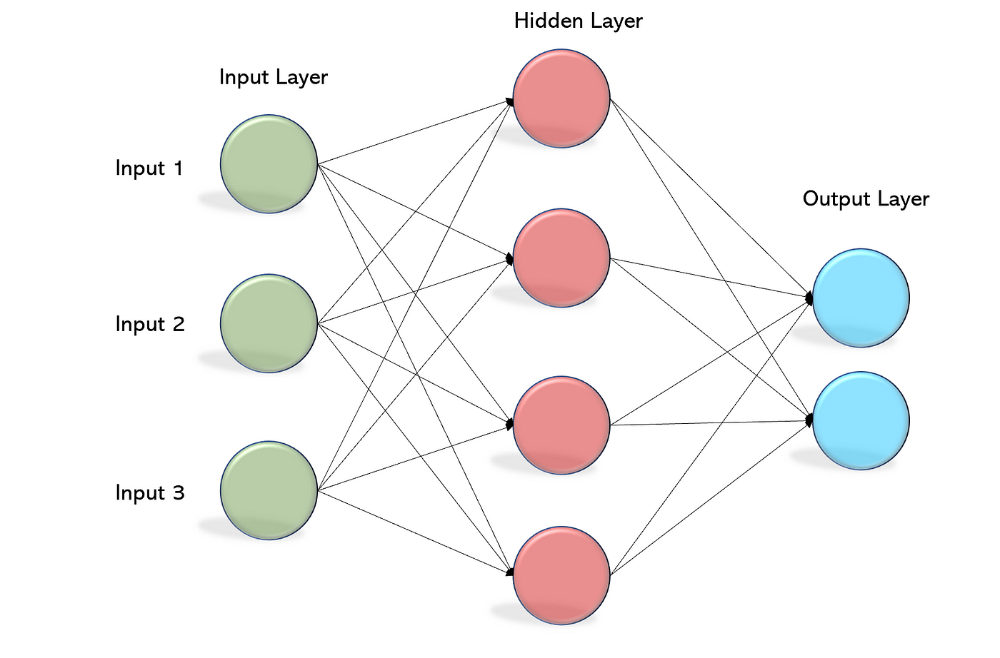

# ECE-385
Repository for ECE 385 Labs: This repository is not for copying or plagiarism, only for reference.

Google Drive Folder for Lab Reports: https://drive.google.com/drive/folders/1IDm4uJgUrv-CRCThsT9souQDmplNP_dR?usp=sharing

# Final Project Information: IMERSIV NET (Intelligent Mathematical Equation Recognition System in Verilog)
## Description: 
The final project incorporates handwritten character recognition into a Microsoft Paint-like environment. The character recognition utilizes a simple multilayer perceptron to detect binary 28x28 images of numerical character (0-9). The datasheet used was a binarized version of the classic MNIST dataset broken down into smaller training, validation, and testing datasets. The model was trained outside the FPGA using Python. Weights and biases would be collected from the training and translated into the SystemVerilog implementation of the neural network. The goal of this project was to develop a neural network hardware accelerator that provided comparable accuracy to the theoretical implementaion. 

## Testing and Validation:
Testing and validation was a huge part of this project as it is important to verify the accuracy of the neural network. The project is already capable of running on modelsim using `imersiv_net_testbench.sv`. The testbench runs the neural network through 1-10,000 images, tracking the accuracy of the model as a percentage of correct guesses. 

## Materials Needed: 
DE10-LITE, VGA Monitor, Quartus, ModelSIM

## Running the Project: 
The project can be synthesized in Quartus Prime using `Imersiv_NN_top.sv`. Platform designer will also have to be set up with the given `.qsys` file in the `./src` directory. Once the code has been compiled, the NIOS-II Eclipse IDE will be needed to run the C code found in `FinalProject/Imersiv_NN_Software/software`. Adjustments to the neural network python scripts found in `FinalProject/NN_validation` will have to extract the weights and biases and apply them to the `.mif` files found in `FinalProject/SV_Hardware/src/nn_src/w_b`. 

## Demonstration: 
IMERSIV Net has a basic GUI and USB mouse interface for drawing numerical charcters to the VGA monitor. The buttons on the DE-LITE Board can be used to tell the system to compute the drawn characters. Characters must be drawn inside the 5 red boxes. Left click on the mouse is used to draw, right click to erase. 

## Contact:
General question about the project can be directed to `maxma2@illinois.edu`(SystemVerilog/Validation/Hardware Implementation) or `dkulgod2@illinois.edu`(Neural Network Design)
Although this is an opensource project, please contact us for approval. 
